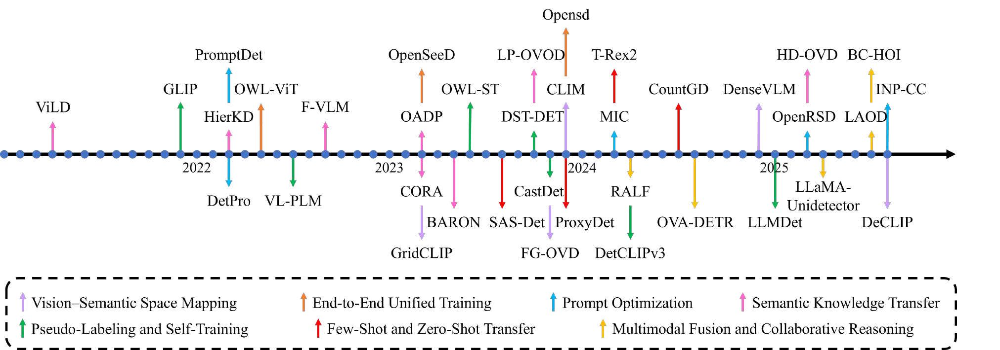
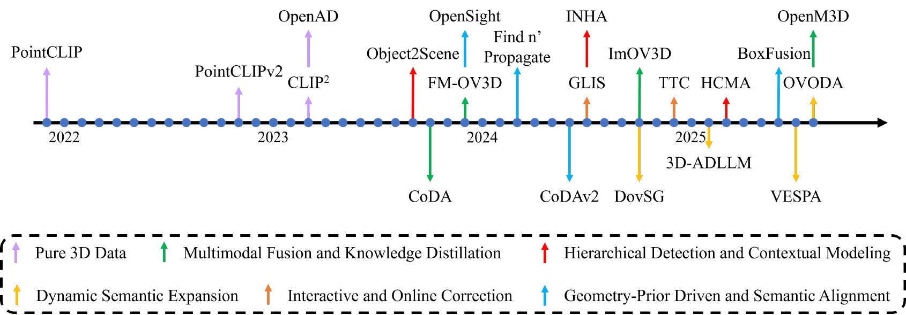

# Open-Vocabulary-Object-Detection

Our paper “_**[Open-Vocabulary Object Detection: A Comprehensive Survey]()**_”

     
    

     
    

## Papers

### 2025

#### CVPR 2025 (Accepted Papers)

* [Submitted 15 August, 2025] Generalized Decoupled Learning for EnhancingOpen-Vocabulary Dense Perception [[paper](https://arxiv.org/pdf/2508.11256)][[code](https://github.com/xiaomoguhz/DeCLIP)]
* [Submitted 31 January, 2025] LLMDet: Learning Strong Open-Vocabulary Object Detectors under the Supervision of Large Language Models [[paper](https://arxiv.org/pdf/2501.18954)][[code](https://github.com/iSEE-Laboratory/LLMDet)]

#### ICCV 2025 (Accepted Papers)
* [Submitted 19 September, 2025] Sparse Multiview Open-Vocabulary 3D Detection [[paper](https://arxiv.org/pdf/2509.15924)]
* [Submitted 27 August, 2025] OpenM3D: Open Vocabulary Multi-view Indoor 3D Object Detection without Human Annotations [[paper](https://arxiv.org/pdf/2508.20063)]
* [Submitted 23 July, 2025] Dynamic-DINO: Fine-Grained Mixture of Experts Tuning for Real-time Open-Vocabulary Object Detection [[paper](https://arxiv.org/pdf/2507.17436)][[code](https://github.com/wengminghe/Dynamic-DINO)]
* [Submitted 9 July, 2025] Bilateral Collaboration with Large Vision-Language Models for Open Vocabulary Human-Object Interaction Detection [[paper](https://arxiv.org/pdf/2507.06510)][[code](https://github.com/MPI-Lab/BC-HOI)]
* [Submitted 5 August, 2025] Open-Vocabulary HOI Detection with Interaction-aware Prompt and Concept Calibration [[paper](https://arxiv.org/pdf/2508.03207)][[code](https://github.com/ltttpku/INP-CC)]
* [Submitted 9 December, 2024] DenseVLM: A Retrieval and Decoupled Alignment Framework for Open-Vocabulary Dense Prediction [[paper](https://arxiv.org/pdf/2412.06244#)]

#### AAAI 2025 (Accepted Papers)

* [Submitted 10 March, 2025] Hierarchical Cross-Modal Alignment for Open-Vocabulary 3D Object Detection [[paper](https://arxiv.org/pdf/2503.07593)][[code](https://github.com/YoujunZhao/HCMA)]
* [Submitted 17 August, 2024] Locate Anything on Earth: Advancing Open-Vocabulary Object Detection for Remote Sensing Community [[paper](https://arxiv.org/pdf/2408.09110)][[code](https://github.com/jaychempan/LAE-DINO)]

#### ICLR 2025 (Accepted Papers)

* [Submitted 10 December, 2024] Test-time Correction with Human Feedback: An Online 3D Detection System via Visual Prompting [[paper](https://arxiv.org/pdf/2412.07768)]
* [Submitted 27 February, 2025] 3D-AffordanceLLM: Harnessing Large Language Models for Open-Vocabulary Affordance Detection in 3D Worlds [[paper](https://arxiv.org/pdf/2502.20041)]

#### BMVC 2025 (Accepted Papers)

* [Submitted 22 August, 2025] Towards Open-Vocabulary Multimodal 3D Object Detection with Attributes [[paper](https://arxiv.org/pdf/2508.16812)]

#### WACV 2025 (Accepted Papers)

* [Submitted 19 November, 2023] Enhancing Novel Object Detection via Cooperative Foundational Models [[paper](https://arxiv.org/pdf/2311.12068)][[code](https://github.com/rohit901/cooperative-foundational-models)]

#### ICRA 2025 (Accepted Papers)

* [Submitted 19 March, 2025] Fine-Grained Open-Vocabulary Object Detection with Fined-Grained Prompts: Task, Dataset and Benchmark [[paper](https://arxiv.org/pdf/2503.14862)][[code](https://github.com/tengerye/3FOVD)]

#### TGRS 2025 (Accepted Papers)

* [Submitted 25 April, 2025] LLaMA-Unidetector: An LLaMA-Based Universal Framework for Open-Vocabulary Object Detection in Remote Sensing Imagery [[paper](https://ieeexplore.ieee.org/document/10976651)][[code](https://github.com/ChloeeGrace/LLaMA-Unidetector)]

#### TMM 2025 (Accepted Papers)

* [Submitted 13 March, 2025] A Hierarchical Semantic Distillation Framework for Open-Vocabulary Object Detection [[paper](https://arxiv.org/pdf/2503.10152)]

#### Arxiv

* [Submitted 27 July, 2025] VESPA: Towards un(Human)supervised Open-World Pointcloud Labeling for Autonomous Driving [[paper](https://arxiv.org/pdf/2507.20397)]
* [Submitted 6 July, 2025] Just Add Geometry: Gradient-Free Open-Vocabulary 3D Detection Without Human-in-the-Loop [[paper](https://arxiv.org/pdf/2507.13363)][[code](https://github.com/atharv0goel/open-world-3D-det)]
* [Submitted 6 July, 2025] Just Add Geometry: Gradient-Free Open-Vocabulary 3D Detection Without Human-in-the-Loop [[paper](https://arxiv.org/pdf/2507.13363)][[code](https://github.com/atharv0goel/open-world-3D-det)]
* [Submitted 9 March, 2025] OV-SCAN: Semantically Consistent Alignment for Novel Object Discovery in Open-Vocabulary 3D Object Detection [[paper](https://arxiv.org/pdf/2503.06435)]
* [Submitted 18 June, 2025] BoxFusion: Reconstruction-Free Open-Vocabulary 3D Object Detection via Real-Time Multi-View Box Fusion [[paper](https://arxiv.org/pdf/2506.15610)][[code](https://github.com/lanlan96/BoxFusion/tree/main)]
* [Submitted 14 July, 2025] LLM-Guided Agentic Object Detection for Open-World Understanding [[paper](https://arxiv.org/abs/2507.10844)][[code]([https://github.com/furkanmumcu/LAOD]
* [Submitted 9 July, 2025] LOVON: Legged Open-Vocabulary Object Navigator [[paper](https://arxiv.org/pdf/2507.06747)][[code]([https://github.com/DaojiePENG/LOVON]
* [Submitted 8 March, 2025] OpenRSD: Towards Open-prompts for Object Detection in Remote Sensing Images [[paper](https://arxiv.org/pdf/2503.06146)]

### 2024

#### CVPR 2024
* [Submitted 14 April, 2024] DetCLIPv3: Towards Versatile Generative Open-vocabulary Object Detection [[paper](https://arxiv.org/pdf/2404.09216)]
* [Submitted 11 August, 2023] Taming Self-Training for Open-Vocabulary Object Detection [[paper](https://openaccess.thecvf.com/content/CVPR2024/papers/Zhao_Taming_Self-Training_for_Open-Vocabulary_Object_Detection_CVPR_2024_paper.pdf)][[code](https://github.com/xiaofeng94/SAS-Det)]
* [Submitted 29 November, 2023] The devil is in the fine-grained details: Evaluating open-vocabulary object detectors for fine-grained understanding [[paper](https://arxiv.org/pdf/2311.17518)][[code](https://github.com/lorebianchi98/FG-OVD)]
* [Submitted 8 April, 2024] Retrieval-augmented open-vocabulary object detection [[paper](https://arxiv.org/pdf/2404.05687)][[code](https://github.com/mlvlab/RALF)]

#### AAAI 2024
* [Submitted 22 December, 2023] FM-OV3D: Foundation Model-based Cross-modal Knowledge Blending for Open-Vocabulary 3D Detection [[paper](https://arxiv.org/pdf/2312.14465)][[code](https://github.com/dmzhang0425/FM-OV3D)]
* [Submitted 16 December, 2023] Simple Image-level Classification Improves Open-vocabulary Object Detection [[paper](https://arxiv.org/pdf/2312.10439)][[code](https://github.com/mala-lab/SIC-CADS)]
* [Submitted 12 December, 2023] ProxyDet: Synthesizing Proxy Novel Classes via Classwise Mixup for Open-Vocabulary Object Detection [[paper](https://arxiv.org/pdf/2312.07266)][[code](https://github.com/clovaai/ProxyDet)]
* [Submitted 18 December, 2023] CLIM: Contrastive Language-Image Mosaic for Region Representation [[paper](https://arxiv.org/pdf/2312.11376)][[code](https://github.com/wusize/CLIM)]
* [Submitted 19 December, 2023] Weakly supervised open-vocabulary object detection [[paper](https://arxiv.org/pdf/2312.12437)][[code](https://github.com/HunterJ-Lin/WSOVOD)]

#### ECCV 2024
* [Submitted 28 March, 2024] OV-Uni3DETR: Towards Unified Open-Vocabulary 3D Object Detection via Cycle-Modality Propagation [[paper](https://arxiv.org/pdf/2403.19580)][[code](https://github.com/zhenyuw16/Uni3DETR)]
* [Submitted 20 March, 2024] Find n' Propagate: Open-Vocabulary 3D Object Detection in Urban Environments [[paper](https://arxiv.org/pdf/2403.13556)][[code](https://github.com/djamahl99/findnpropagate)]
* [Submitted 7 July, 2024] Unlocking Textual and Visual Wisdom: Open-Vocabulary 3D Object Detection Enhanced by Comprehensive Guidance from Text and Image [[paper](https://arxiv.org/pdf/2407.05256)]
* [Submitted 12 December, 2023] OpenSight: A Simple Open-Vocabulary Framework for LiDAR-Based Object Detection [[paper](https://arxiv.org/pdf/2312.08876)]
* [Submitted 12 July, 2024] Global-Local Collaborative Inference with LLM for Lidar-Based Open-Vocabulary Detection [[paper](https://arxiv.org/pdf/2407.08931)][[code](https://github.com/GradiusTwinbee/GLIS)]
* [Submitted 15 September, 2024] Detection-oriented image-text pretraining for open-vocabulary detection [[paper](https://openreview.net/pdf/b860f68f805509dac4ab3fceb46f433ea4b5a745.pdf)]

#### TPAMI 2024

* [Submitted 2 June, 2024] Collaborative Novel Object Discovery and Box-Guided Cross-Modal Alignment for Open-Vocabulary 3D Object Detection [[paper](https://arxiv.org/pdf/2406.00830)][[code](https://github.com/yangcaoai/CoDA_NeurIPS2023)]

#### NeurlPS 2024

* [Submitted 31 October, 2024] ImOV3D: Learning Open-Vocabulary Point Clouds 3D Object Detection from Only 2D Images [[paper](https://arxiv.org/pdf/2410.24001)]
* [Submitted 23 November, 2024] Training an Open-Vocabulary Monocular 3D Object Detection Model without 3D Data [[paper](https://arxiv.org/pdf/2407.08931)][[code](https://github.com/LeapLabTHU/OVM3D-Det/tree/main)]
* [Submitted 5 July, 2024] CountGD: Multi-Modal Open-World Counting [[paper](https://arxiv.org/pdf/2407.04619)][[code](https://github.com/niki-amini-naieni/CountGD/)]
* [Submitted 10 December, 2023] Opensd: Unified open-vocabulary segmentation and detection [[paper](https://arxiv.org/pdf/2312.06703)]

#### ICRA 2024

* [Submitted 19 September, 2023] Open-Vocabulary Affordance Detection Using Knowledge Distillation and Text-Point Correlation [[paper](https://arxiv.org/pdf/2309.10932)]

#### ICLR 2024

* [Submitted 2 October, 2023] CLIPSelf: Vision Transformer Distills Itself for Open-Vocabulary Dense Prediction [[paper](https://arxiv.org/pdf/2310.01403)][[code](https://github.com/wusize/CLIPSelf)]
* [Submitted 7 February, 2024] LLMs Meet VLMs: Boost Open Vocabulary Object Detection with Fine-grained Descriptors [[paper](https://arxiv.org/pdf/2402.04630)]

#### WACV 2024

* [Submitted 26 October, 2023] LP-OVOD: Open-Vocabulary Object Detection by Linear Probing [[paper](https://arxiv.org/abs/2310.17109)][[code](https://github.com/VinAIResearch/LP-OVOD)]
* [Submitted 7 February, 2024] LLMs Meet VLMs: Boost Open Vocabulary Object Detection with Fine-grained Descriptors [[paper](https://arxiv.org/pdf/2402.04630)]

#### Arxiv

* [Submitted 10 July, 2024] OV-DINO: Unified Open-Vocabulary Detection with Language-Aware Selective Fusion [[paper](https://arxiv.org/pdf/2407.07844)][[code](https://github.com/wanghao9610/OV-DINO)]
* [Submitted 13 September, 2024] Mamba-YOLO-World: Marrying YOLO-World with Mamba for Open-Vocabulary Detection [[paper](https://arxiv.org/pdf/2409.08513)]
* [Submitted 4 January, 2024] An open and comprehensive pipeline for unified object grounding and detection [[paper](https://arxiv.org/pdf/2401.02361)][[code](https://github.com/open-mmlab/mmdetection/tree/main/configs/mm_grounding_dino)]

#### CVPR 2023

* [Submitted 3 April, 2023] Open-Vocabulary Point-Cloud Object Detection without 3D Annotation [[paper](https://openaccess.thecvf.com/content/CVPR2023/papers/Lu_Open-Vocabulary_Point-Cloud_Object_Detection_Without_3D_Annotation_CVPR_2023_paper.pdf)][[code](https://github.com/lyhdet/OV-3DET)]
* [Submitted 3 April, 2023] Open-Vocabulary Point-Cloud Object Detection without 3D Annotation [[paper](https://openaccess.thecvf.com/content/CVPR2023/papers/Lu_Open-Vocabulary_Point-Cloud_Object_Detection_Without_3D_Annotation_CVPR_2023_paper.pdf)][[code](https://github.com/lyhdet/OV-3DET)]
* [Submitted 22 March, 2023] Clip^2: Contrastive language-imagepoint pretraining from real-world point cloud data [[paper](https://arxiv.org/pdf/2303.12417)]
* [Submitted 10 April, 2023] DetCLIPv2: Scalable Open-Vocabulary Object Detection Pre-training via Word-Region Alignment [[paper](https://arxiv.org/pdf/2304.04514)]
* [Submitted 27 February, 2023] Aligning Bag of Regions for Open-Vocabulary Object Detection [[paper](https://arxiv.org/abs/2302.13996)][[code](https://github.com/wusize/ovdet)]
* [Submitted 23 March, 2023] CORA: Adapting CLIP for Open-Vocabulary Detection with Region Prompting and Anchor Pre-Matching [[paper](https://arxiv.org/pdf/2303.13076)][[code](https://github.com/tgxs002/CORA)]
* [Submitted 10 March, 2023] Object-Aware Distillation Pyramid for Open-Vocabulary Object Detection [[paper](https://arxiv.org/pdf/2303.05892)][[code](https://github.com/LutingWang/OADP)]
* [Submitted 11 March, 2023] Region-Aware Pretraining for Open-Vocabulary Object Detection with Vision Transformers [[paper](https://arxiv.org/pdf/2305.07011)][[code](https://github.com/mcahny/rovit)]
* [Submitted 23 December, 2022] Learning to Detect and Segment for Open Vocabulary Object Detection [[paper](https://arxiv.org/pdf/2305.07011)]
* [Submitted 23 January, 2023] Ovarnet: Towards open-vocabulary object attribute recognition [[paper](https://arxiv.org/pdf/2301.09506)][[code](https://chenkeyan.top/OvarNet/)]
* [Submitted 23 January, 2023] Ovarnet: Towards open-vocabulary object attribute recognition [[paper](https://arxiv.org/pdf/2301.09506)][[code](https://chenkeyan.top/OvarNet/)]

### 2023

#### ICCV 2023

* [Submitted 3 April, 2023] Open-Vocabulary Point-Cloud Object Detection without 3D Annotation [[paper](https://openaccess.thecvf.com/content/CVPR2023/papers/Lu_Open-Vocabulary_Point-Cloud_Object_Detection_Without_3D_Annotation_CVPR_2023_paper.pdf)][[code](https://github.com/lyhdet/OV-3DET)]
* [Submitted 21 November, 2022] Pointclip v2: Prompting clip and gpt for powerful 3d open-world learning [[paper](https://arxiv.org/pdf/2211.11682)][[code](https://github.com/yangyangyang127/PointCLIP_V2)]
* [Submitted 25 September, 2022] Unsupervised 3D Perception with 2D Vision-Language Distillation for Autonomous Driving [[paper](https://arxiv.org/pdf/2211.11682)]
* [Submitted 15 January, 2024] Distilling DETR with Visual-Linguistic Knowledge for Open-Vocabulary Object Detection [[paper](https://openaccess.thecvf.com/content/ICCV2023/papers/Li_Distilling_DETR_with_Visual-Linguistic_Knowledge_for_Open-Vocabulary_Object_Detection_ICCV_2023_paper.pdf)]
* [Submitted 3 September, 2022] EdaDet: Open-Vocabulary Object Detection Using Early Dense Alignment [[paper](https://arxiv.org/pdf/2309.01151)]
* [Submitted 15 September, 2022] Detection-Oriented Image-Text Pretraining for Open-Vocabulary Detection [[paper](https://openreview.net/pdf/b860f68f805509dac4ab3fceb46f433ea4b5a745.pdf)]
* [Submitted 14 March, 2023] A simple framework for open-vocabulary segmentation and detection [[paper](https://arxiv.org/pdf/2303.08131)][[code](https://github.com/IDEA-Research/OpenSeeD)]
* [Submitted 2 September, 2023] Contrastive feature masking open-vocabulary vision transformer [[paper](https://arxiv.org/pdf/2309.00775)]

#### NeurlPS 2023

* [Submitted 4 October, 2023] CoDA: Collaborative Novel Box Discovery and Cross-modal Alignment for Open-vocabulary 3D Object Detection [[paper](https://arxiv.org/abs/2310.02960)][[code](https://github.com/yangcaoai/CoDA_NeurIPS2023)]
* [Submitted 4 October, 2023] Scaling Open-Vocabulary Object Detection [[paper](https://arxiv.org/pdf/2306.09683)]
* [Submitted 25 October, 2023] CoDet: Co-Occurrence Guided Region-Word Alignment for Open-Vocabulary Object Detection [[paper](https://arxiv.org/pdf/2310.16667)][[code](https://github.com/CVMI-Lab/CoDet)]
* [Submitted 24 June, 2023] Desco: Learning object recognition with rich language descriptions [[paper](https://arxiv.org/pdf/2306.14060)]

### 2022

#### CVPR 2022

* [Submitted 4 December, 2021] Pointclip: Point cloud understanding by clip [[paper](https://arxiv.org/abs/2112.02413)]
* [Submitted 28 March, 2022] Learning to Prompt for Open-Vocabulary Object Detection with Vision-Language Model [[paper](https://arxiv.org/abs/2203.14940)][[code](https://github.com/dyabel/detpro)]
* [Submitted 20 March, 2022] Open-Vocabulary One-Stage Detection with Hierarchical Visual-Language Knowledge Distillation [[paper](https://arxiv.org/pdf/2203.10593)][[code](https://github.com/mengqiDyangge/HierKD)]
* [Submitted 16 December, 2021] RegionCLIP: Region-based Language-Image Pretraining [[paper](https://arxiv.org/pdf/2112.09106)][[code](https://github.com/microsoft/RegionCLIP)]
* [Submitted 6 December, 2022] Open World DETR: Transformer based Open World Object Detection [[paper](https://arxiv.org/pdf/2212.02969)]

#### Arxiv

* [Submitted 5 July, 2022] Open-Vocabulary 3D Detection via Image-level Class and Debiased Cross-modal Contrastive Learning [[paper](https://arxiv.org/pdf/2207.01987)]
* [Submitted 22 June, 2022] Open Vocabulary Object Detection with Proposal Mining and Prediction Equalization [[paper](https://arxiv.org/pdf/2206.11134)]

### 2021

#### ICML 2021

* [Submitted 26 February, 2021] Learning transferable visual models from natural language supervision [[paper](https://arxiv.org/pdf/2103.00020)][[code](https://github.com/OpenAI/CLIP)]

#### CVPR 2021
* [Submitted 20 November, 2020] Open-Vocabulary Object Detection Using Captions [[paper](https://arxiv.org/pdf/2011.10678)][[code](https://github.com/alirezazareian/ovr-cnn)]

## Survey

* [Submitted 25 April, 2025] A Review of 3D Object Detection with Vision-Language Models [[paper](https://arxiv.org/pdf/2504.18738)]
* [Submitted 4 July, 2025] Open-Vocabulary Object Detection in UAV Imagery: A Review and Future Perspectives [[paper](https://arxiv.org/pdf/2507.13359)][[code](https://github.com/zhouyang2002/OVOD-in-UVA-imagery)]
* [Submitted 18 July, 2023] A Survey on Open-Vocabulary Detection and Segmentation: Past, Present, and Future [[paper](https://arxiv.org/pdf/2307.09220)][[code](https://github.com/seanzhuh/awesome-open-vocabulary-detection-and-segmentation)]
* [Submitted 13 April, 2025] Vision-Language Model for Object Detection and Segmentation: A Review and Evaluation [[paper](https://arxiv.org/pdf/2504.09480)][[code](https://github.com/better-chao/perceptual_abilities_evaluation)]
* [Submitted 28 June, 2023] Towards Open Vocabulary Learning: A Survey [[paper](https://arxiv.org/pdf/2306.15880)][[code](https://github.com/jianzongwu/Awesome-Open-Vocabulary)]

## Dataset
* [Submitted 1 May, 2014] Microsoft COCO: Common Objects in Context [[paper](https://arxiv.org/pdf/1405.0312)]
* [Submitted 8 August, 2019] LVIS: A Dataset for Large Vocabulary Instance Segmentation [[paper](https://arxiv.org/pdf/1908.03195)][[dataset download](https://www.lvisdataset.org/)]
* [Submitted October, 2019] Objects365: A Large-scale, High-quality Dataset for Object Detection [[paper](https://openaccess.thecvf.com/content_ICCV_2019/papers/Shao_Objects365_A_Large-Scale_High-Quality_Dataset_for_Object_Detection_ICCV_2019_paper.pdf)][[dataset download](https://www.objects365.org/overview.html)]
* [Submitted 14 February, 2017] ScanNet: Richly-annotated 3D Reconstructions of Indoor Scenes [[paper](https://arxiv.org/pdf/1702.04405)][[dataset download](http://www.scan-net.org/)]
* Occupancy Dataset for nuScenes [[Github](https://github.com/FANG-MING/occupancy-for-nuscenes)]
* [Submitted 1 June, 2015] SUN RGB-D: A RGB-D Scene Understanding Benchmark Suite [[paper](https://rgbd.cs.princeton.edu/paper.pdf)][[dataset download](https://rgbd.cs.princeton.edu/)]

## Challenge
